# CLAUDE.md

**Last Updated**: 2026-04-29

## 变更记录 (Changelog)

### v3.6.5 (2026-04)
- 新增小米 MiMo 大模型 API 供应商预设（按量付费 + Token Plan）

### v3.6.4 (2026-04)
- 更新 MiniMax 提供商预设为 M2.7 系列模型，修正 API 端点（api.minimax.io）
- 百炼 Coding 预设默认模型改为小写 `glm-5`

### v3.6.3
- 新增 BMAD 多智能体命令与工作流（bmad-agent-_、bmad-bmm-_、bmad-editorial-_ 等）
- 新增 Crazyrouter 赞助商及 API 提供商预设

### v3.6.2
- 将 bmad-init 模板从 V4 升级至 V6
- 支持在初始化时跳过输出风格选择
- 更新 API 提供商预设并新增服务

### v3.6.1
- 添加 AICodeMirror API 提供商预设（含中国优化线路 AICodeMirror CN）
- 移除 Codex chat 格式支持（已弃用功能）

### v3.6.0
- 新增 Leibus 工程师输出风格（专业技术指导）
- 新增 rem-engineer 输出风格（动漫风格开发辅助）

### v3.5.1
- 实现精准 TOML 更新机制，防止 MCP 配置被破坏
- 使用 @rainbowatcher/toml-edit-js 替换 smol-toml
- 更新 Codex 模型选项和默认配置
- 移除 writeCodexConfig 函数（代码清理）

### v3.5.0
- 将模板整合到 common 目录以提高代码复用
- 统一 output-styles、git workflows 和 sixStep workflows 到 `templates/common/`
- 移除重复的 Codex 模板（现与 Claude Code 共享）
- 统一 sixStep 计划目录为 `.tkp`

## Project Overview

TKP CLI v3.6.5 is a CLI tool that automatically configures Claude Code and Codex environments. Built with TypeScript and distributed as an npm package, it provides one-click setup for Claude Code and Codex including configuration files, API settings, MCP services, and AI workflows. The current version v3.6.4 features advanced i18next internationalization, enhanced engineering templates (BMAD V6, Leibus engineer, rem-engineer), intelligent IDE detection, comprehensive multi-platform support including Termux compatibility, sophisticated uninstallation capabilities with advanced conflict resolution, and an expanded API provider preset system (302.AI, GLM, MiniMax, Kimi, PackyCode, AICodeMirror, Crazyrouter, Bailian Coding, Z.ai, MiMo). The project integrates dual code tool support, enabling both Claude Code and Codex environment configuration, with a consolidated template architecture for shared resources.

## Architecture Overview

TKP follows a modular CLI architecture with strict TypeScript typing, comprehensive i18next-based internationalization, and cross-platform support. The project is built using modern tooling including unbuild, Vitest, ESM-only configuration, and @antfu/eslint-config for code quality. The architecture emphasizes robust error handling, user-friendly interfaces, and extensive testing coverage with advanced tool integration including CCR proxy, Cometix status line, CCusage analytics, and BMAD multi-agent workflows. Version 3.5.x+ introduces consolidated template architecture with shared resources in `templates/common/` for output styles, git workflows, and sixStep workflows, enabling code reuse between Claude Code and Codex. Version 3.6.x adds new output styles (Leibus engineer, rem-engineer), expanded API provider presets (AICodeMirror, Crazyrouter), and BMAD V6 multi-agent upgrades.

### Module Structure Diagram

```mermaid
graph TD
    A["TKP Root (v3.6.5)"] --> B["src/commands"];
    A --> C["src/utils"];
    A --> D["src/i18n"];
    A --> E["src/types"];
    A --> F["src/config"];
    A --> G["templates"];
    A --> H["tests"];
    A --> I["docs"];
    A --> J[".bmad-core"];

    B --> B1["init.ts - Full initialization"];
    B --> B2["menu.ts - Interactive UI"];
    B --> B3["update.ts - Workflow updates"];
    B --> B4["ccr.ts - Router management"];
    B --> B5["ccu.ts - Usage analysis"];
    B --> B6["check-updates.ts - Tool updates"];
    B --> B7["uninstall.ts - TKP uninstallation"];
    B --> B8["config-switch.ts - Config switching"];

    C --> C1["config.ts - Configuration management"];
    C --> C2["installer.ts - Claude Code installation"];
    C --> C3["mcp.ts - MCP services"];
    C --> C4["platform.ts - Cross-platform support"];
    C --> C5["workflow-installer.ts - Workflow management"];
    C --> C6["ccr/ - CCR integration"];
    C --> C7["cometix/ - Status line tools"];
    C --> C8["code-tools/ - Codex integration"];
    C --> C9["uninstaller.ts - Advanced uninstaller"];
    C --> C10["trash.ts - Cross-platform trash"];
    C --> C11["claude-code-config-manager.ts"];
    C --> C12["claude-code-incremental-manager.ts"];
    C --> C13["features.ts"];
    C --> C14["tkp-config.ts"];

    D --> D1["locales/zh-CN/ - Chinese translations"];
    D --> D2["locales/en/ - English translations"];
    D --> D3["index.ts - i18next system"];

    E --> E1["workflow.ts - Workflow types"];
    E --> E2["config.ts - Configuration types"];
    E --> E3["ccr.ts - CCR types"];

    F --> F1["workflows.ts - Workflow definitions"];
    F --> F2["mcp-services.ts - MCP configurations"];
    F --> F3["api-providers.ts - API provider presets"];

    G --> G1["common/ - Shared templates (output-styles, git, sixStep)"];
    G --> G2["claude-code/ - Claude Code templates"];
    G --> G3["codex/ - Codex templates"];

    H --> H1["commands/ - Command tests"];
    H --> H2["utils/ - Utility tests"];
    H --> H3["unit/ - Unit test suites"];
    H --> H4["integration/ - Integration tests"];
    H --> H5["edge/ - Edge case tests"];
    H --> H6["i18n/ - I18n tests"];
    H --> H7["templates/ - Template tests"];

    I --> I1["VitePress multilingual docs (zh-CN, en, ja-JP)"];
    J --> J1["BMAD V6 core modules"];

    click B "./src/commands/CLAUDE.md" "View commands module"
    click C "./src/utils/CLAUDE.md" "View utils module"
    click D "./src/i18n/CLAUDE.md" "View i18n module"
    click E "./src/types/CLAUDE.md" "View types module"
    click F "./src/config/CLAUDE.md" "View config module"
    click G "./templates/CLAUDE.md" "View templates module"
    click H "./tests/CLAUDE.md" "View tests module"
```



## Module Index

| Module | Path | Description | Entry Points | Test Coverage |
|------------------------|--------------|---------------------------------------|-------------------------------------------------------|-------------------------------|
| **Commands** | `src/commands/` | CLI command implementations with advanced interactive and non-interactive modes, comprehensive uninstallation, config switching, and dual code tool support | init.ts, menu.ts, update.ts, ccr.ts, ccu.ts, check-updates.ts, uninstall.ts, config-switch.ts | High - comprehensive test suites |
| **Utilities** | `src/utils/` | Core functionality with enhanced configuration management, platform support, Codex integration, advanced uninstallation, TOML editing | config.ts, installer.ts, platform.ts, workflow-installer.ts, ccr/, cometix/, code-tools/, uninstaller.ts, trash.ts, claude-code-config-manager.ts, claude-code-incremental-manager.ts, features.ts, tkp-config.ts | High - extensive unit tests |
| **CCR Integration** | `src/utils/ccr/` | Claude Code Router proxy management and configuration | presets.ts, commands.ts, installer.ts, config.ts | High - comprehensive CCR tests |
| **Cometix Tools** | `src/utils/cometix/` | Status line tools and configuration management | errors.ts, common.ts, types.ts, commands.ts, installer.ts, menu.ts | High - extensive Cometix tests |
| **Code Tools** | `src/utils/code-tools/` | Codex integration and dual code tool support | codex-config-detector.ts, codex-provider-manager.ts, codex-uninstaller.ts, codex-platform.ts, codex-config-switch.ts, codex-configure.ts, codex.ts | High - comprehensive Codex tests |
| **Internationalization** | `src/i18n/` | Advanced i18next multilingual support with 17 namespaces and complete translations | index.ts, locales/zh-CN/, locales/en/ | High - translation validation |
| **Types** | `src/types/` | Comprehensive TypeScript type definitions | workflow.ts, config.ts, ccr.ts | Implicit through usage |
| **Configuration** | `src/config/` | Centralized workflow, MCP service, and API provider configurations (12 providers) | workflows.ts, mcp-services.ts, api-providers.ts | High - config validation tests |
| **Templates** | `templates/` | Consolidated multilingual templates with shared resources in common/ for output-styles (8 styles), git workflows, sixStep workflows, BMAD V6, and BMAD multi-agent | common/, claude-code/, codex/ | Medium - template validation tests |
| **Testing** | `tests/` | Comprehensive test suites with layered coverage architecture | commands/, utils/, unit/, integration/, edge/, i18n/, templates/ | Self-testing with 80% target |
| **Documentation** | `docs/` | VitePress documentation site with multilingual support (zh-CN, en, ja-JP) | .vitepress/config/ | Documentation site |
| **BMAD Core** | `.bmad-core/` | BMAD V6 enterprise workflow core modules (multi-agent commands) | bmad-agent-_, bmad-bmm-_, bmad-editorial-_, etc. | Via BMAD system |

## Output Styles

TKP v3.6.x supports 8 output styles:
1. **engineer-professional** - Professional engineering style (default)
2. **laowang-engineer** - Laowang engineer with practical approach
3. **nekomata-engineer** - Nekomata cat-girl engineer personality
4. **ojousama-engineer** - Ojou-sama aristocrat engineer
5. **leibus-engineer** - Leibus professional technical guidance (v3.6.0+)
6. **rem-engineer** - Rem anime-inspired development assistant (v3.6.0+)
7. **default** - Default output style
8. **explanatory** - Explanatory style
9. **learning** - Learning-focused style

## API Provider Presets

TKP v3.6.x supports 12 API provider presets:
1. **302.AI** - 302.AI API Service (Claude Code + Codex)
2. **PackyCode** - PackyCode API Service (Claude Code + Codex)
3. **AICodeMirror** - AICodeMirror Global Line (Claude Code + Codex, v3.6.1+)
4. **AICodeMirror CN** - AICodeMirror China Optimized Line (Claude Code + Codex, v3.6.1+)
5. **Crazyrouter** - Crazyrouter AI API aggregation gateway (Claude Code + Codex, v3.6.3+)
6. **GLM CN** - GLM (Zhipu AI) (Claude Code only)
7. **Z.ai** - Z.ai API Service (Claude Code only)
8. **Bailian Coding** - Bailian Coding API Service (Claude Code only, default: glm-5)
9. **MiniMax** - MiniMax API Service (Claude Code only, default: MiniMax-M2.7)
10. **Kimi Coding** - Kimi (Moonshot AI) (Claude Code only)
11. **MiMo** - Xiaomi MiMo (Pay-as-you-go) (Claude Code only, default: mimo-v2.5-pro, v3.6.5+)
12. **MiMo Token Plan** - Xiaomi MiMo Token Plan (Claude Code only, default: mimo-v2.5-pro, v3.6.5+)

## CLI Usage

TKP provides both direct commands and an interactive menu system with advanced internationalization and comprehensive uninstallation:

```bash
# Interactive menu (recommended)
npx tkp                    # Opens main menu with all options

# Direct commands
npx tkp i                  # Full initialization
npx tkp u                  # Update workflows only
npx tkp ccr [--lang <en|zh-CN>]  # Claude Code Router management
npx tkp ccu [args...]      # Run ccusage with arguments
npx tkp check-updates [--lang <en|zh-CN>] [--code-type <claude-code|codex>]  # Check tool updates
npx tkp config-switch [target] [--code-type <claude-code|codex>]  # Switch configurations
npx tkp uninstall [--mode <complete|custom|interactive>] [--items <items>] [--lang <en|zh-CN>]  # TKP uninstallation

# Config switch examples
npx tkp config-switch --list                    # List available configurations
npx tkp config-switch provider1 --code-type codex  # Switch Codex provider
npx tkp config-switch config1 --code-type claude-code  # Switch Claude Code config

# Non-interactive (CI/CD) examples
npx tkp i -s -p 302ai -k "sk-xxx"              # Full init with provider preset
npx tkp i -s --all-lang zh-CN --api-type api_key --api-key "key"
npx tkp i -s --api-type ccr_proxy

# Uninstall examples
npx tkp uninstall                                    # Interactive uninstall menu
npx tkp uninstall --mode complete                    # Complete uninstallation
npx tkp uninstall --mode custom --items ccr,backups # Custom uninstallation
```

## Running and Development

### Build & Run

```bash
# Development (uses tsx for TypeScript execution)
pnpm dev

# Build for production (uses unbuild)
pnpm build

# Type checking
pnpm typecheck
```

### Code Quality & Linting

```bash
# Run ESLint (uses @antfu/eslint-config)
pnpm lint

# Fix ESLint issues automatically
pnpm lint:fix
```

### Documentation

```bash
# Start VitePress documentation development server
pnpm docs:dev

# Build documentation for production
pnpm docs:build

# Preview built documentation
pnpm docs:preview
```

### Testing Strategy

```bash
# Run all tests
pnpm test

# Run tests in watch mode (for development)
pnpm test:watch

# Run tests with UI
pnpm test:ui

# Generate coverage report
pnpm test:coverage

# Run tests once
pnpm test:run

# Run specific test file
pnpm vitest utils/config.test.ts

# Run tests matching pattern
pnpm vitest --grep "should handle"

# Run uninstaller tests specifically
pnpm vitest uninstaller
```

The project uses Vitest with a comprehensive layered testing approach:

1. **Core Tests** (`*.test.ts`) - Basic functionality and main flows
2. **Edge Tests** (`*.edge.test.ts`) - Boundary conditions and error scenarios
3. **Unit Tests** (`tests/unit/`) - Isolated function testing
4. **Integration Tests** (`tests/integration/`) - Cross-module interaction testing
5. **Coverage Goals**: 80% minimum across lines, functions, branches, and statements

## Development Guidelines

### Core Principles

- **Documentation Language**: Except for README_zh-CN, all code comments and documentation should be written in English
  - Code comments must be in English
  - All documentation files (*.md) must be in English except README_zh-CN
  - API documentation and inline documentation must use English
  - Git commit messages should be in English

- **Test-Driven Development (TDD)**: All development must follow TDD methodology
  - Write tests BEFORE implementing functionality
  - Follow Red-Green-Refactor cycle: write failing test -> implement minimal code -> refactor
  - Ensure each function/feature has corresponding test coverage before implementation
  - When writing tests, first verify if relevant test files already exist to avoid unnecessary duplication
  - Minimum 80% coverage required across lines, functions, branches, and statements

- **Internationalization (i18n) Guidelines**:
  - All user-facing prompts, logs, and error messages must support i18n via i18next
  - Use project-wide i18n approach with centralized language management
  - Implement translations consistently across the entire project using namespace-based organization
  - Support both zh-CN and en locales with complete feature parity
  - Use `i18n.t()` function for all translatable strings with proper namespace prefixes
  - Organize translations in logical namespaces (17 namespaces: common, api, ccr, cli, cometix, configuration, errors, installation, language, mcp, menu, multi-config, tools, uninstall, updater, workflow, codex)

## Coding Standards

- **ESM-Only**: Project is fully ESM with no CommonJS fallbacks
- **Path Handling**: Uses `pathe` for cross-platform path operations
- **Command Execution**: Uses `tinyexec` for better cross-platform support
- **TypeScript**: Strict TypeScript with explicit type definitions and ESNext configuration
- **Error Handling**: Comprehensive error handling with user-friendly i18n messages
- **Cross-Platform Support**: Special handling for Windows paths, macOS, Linux, and Termux environment
- **Code Formatting**: Uses @antfu/eslint-config for consistent code style with strict rules
- **Testing Organization**: Tests organized with comprehensive unit/integration/edge structure and 80% coverage requirement
- **Trash/Recycle Bin Integration**: Uses `trash` package for safe cross-platform file deletion
- **TOML Configuration**: Uses @rainbowatcher/toml-edit-js (v3.5.1+) for precise TOML editing without corrupting MCP configurations

## Template Architecture (v3.5.0+)

Templates are now consolidated under `templates/common/` for maximum code reuse:

```
templates/
  common/
    output-styles/     # 9 output styles (en + zh-CN)
      en/              # engineer-professional, laowang, nekomata, ojousama, leibus, rem
      zh-CN/           # Same set in Chinese
    workflow/
      git/             # Git commands (en + zh-CN)
      sixStep/         # Six-step workflow (en + zh-CN)
  claude-code/         # Claude Code specific templates
    en/, zh-CN/        # workflow agent templates
  codex/               # Codex specific templates (minimal, shared with Claude Code)
    en/, zh-CN/
```

## AI Usage Guidelines

### Key Architecture Patterns

1. **Advanced Modular Command Structure**: Each command is self-contained with comprehensive options interface and sophisticated error handling
2. **Advanced i18next I18N Support**: All user-facing strings support zh-CN and en localization with namespace-based organization and dynamic language switching
3. **Smart Configuration Merging**: Intelligent config merging with comprehensive backup system to preserve user customizations
4. **Comprehensive Cross-Platform Support**: Windows/macOS/Linux/Termux compatibility with platform-specific adaptations and path handling
5. **Consolidated Template System**: Shared templates in `templates/common/` for output-styles, git workflows, and sixStep workflows, reducing duplication between Claude Code and Codex (v3.5.0+)
6. **Intelligent IDE Integration**: Advanced IDE detection and auto-open functionality for git-worktree environments
7. **Professional AI Personality System**: 9 output styles -- engineer-professional, laowang-engineer, nekomata-engineer, ojousama-engineer, leibus-engineer (v3.6.0+), rem-engineer (v3.6.0+), default, explanatory, learning
8. **Advanced Tool Integration**: Comprehensive integration with CCR proxy, CCusage analytics, Cometix status line tools, and BMAD V6 multi-agent workflows (v3.6.3+)
9. **Sophisticated Uninstallation System**: Advanced uninstaller with conflict resolution, selective removal, and cross-platform trash integration
10. **Dual Code Tool Architecture**: Simultaneous support for Claude Code and Codex environment configuration with shared template resources
11. **API Provider Preset System**: 12 pre-configured providers (v3.6.1+: AICodeMirror added, v3.6.3+: Crazyrouter added, v3.6.5+: MiMo added)
12. **Precise TOML Editing**: @rainbowatcher/toml-edit-js for safe configuration updates without corruption (v3.5.1+)

### Important Implementation Details

1. **Advanced Windows Compatibility**: MCP configurations require sophisticated Windows path handling with proper escaping and validation
2. **Comprehensive Configuration Backup**: All modifications create timestamped backups in `~/.claude/backup/` with full recovery capabilities
3. **Enhanced API Configuration**: Supports Auth Token (OAuth), API Key, and CCR Proxy authentication with comprehensive validation and 10 API provider presets
4. **API Provider Preset System**: Pre-configured settings for 302.AI, PackyCode, AICodeMirror, AICodeMirror CN, Crazyrouter, GLM CN, Z.ai, Bailian Coding, MiniMax, Kimi Coding, MiMo, MiMo Token Plan
5. **Advanced Workflow System**: Modular workflow installation with sophisticated dependency resolution and conflict management
6. **BMAD V6 Workflow**: Upgraded BMAD core with multi-agent commands (bmad-agent-_, bmad-bmm-_, bmad-editorial-_, bmad-review-_, bmad-help, bmad-party-mode) (v3.6.3+)
7. **Intelligent Auto-Update System**: Automated tool updating for Claude Code, CCR, and CCometixLine with comprehensive version checking
8. **Consolidated Template System**: Shared templates architecture with `templates/common/` containing output-styles, git workflows, and sixStep workflows for code reuse (v3.5.0+)
9. **Advanced i18next Integration**: Sophisticated internationalization with 17 namespace-based translation management and dynamic language switching
10. **Comprehensive Tool Integration**: Advanced CCR, Cometix, CCusage, and BMAD multi-agent integration with version management and configuration validation
11. **Sophisticated Uninstaller**: Advanced TKP uninstaller with selective removal, conflict resolution, and cross-platform trash integration
12. **Precise TOML Configuration**: @rainbowatcher/toml-edit-js for targeted TOML field updates without corrupting MCP configurations (v3.5.1+)

### Testing Philosophy

- **Comprehensive Mocking Strategy**: Extensive mocking for file system operations, external commands, and user prompts with realistic scenarios
- **Advanced Cross-platform Testing**: Platform detection mocks with comprehensive environment-specific test cases
- **Sophisticated Edge Case Testing**: Comprehensive boundary conditions, error scenarios, and advanced recovery mechanisms
- **Quality-Focused Coverage**: 80% minimum coverage across all metrics with emphasis on quality over quantity
- **Advanced Test Organization**: Tests organized in dedicated structure with clear categorization, helper functions, and test fixtures
- **Advanced Integration Testing**: Complete workflow scenarios and comprehensive external tool interaction testing
- **API Provider Testing**: Unit test coverage for provider configurations (MiniMax, Bailian Coding presets v3.6.4)

## Release & Publishing

```bash
# Create a changeset for version updates
pnpm changeset

# Update package version based on changesets
pnpm version

# Build and publish to npm
pnpm release
```

## Sponsors

Key sponsors supporting TKP development:
- **GLM** (Z.ai) - AI model sponsorship
- **302.AI** - Enterprise AI resource hub
- **PackyCode** - API relay service provider
- **AICodeMirror** - Official high-stability relay service (v3.6.1+)
- **Crazyrouter** - AI API aggregation gateway (v3.6.3+)

---

**Important Reminders**:

- Do what has been asked; nothing more, nothing less
- NEVER create files unless absolutely necessary for achieving your goal
- ALWAYS prefer editing an existing file to creating a new one
- NEVER proactively create documentation files (*.md) or README files. Only create documentation files if explicitly requested by the User.
- Never save working files, text/mds and tests to the root folder
